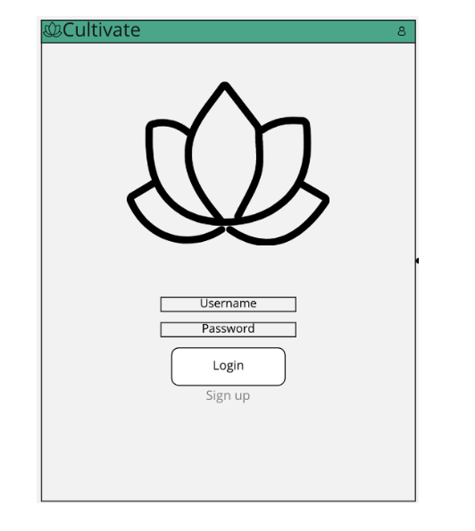
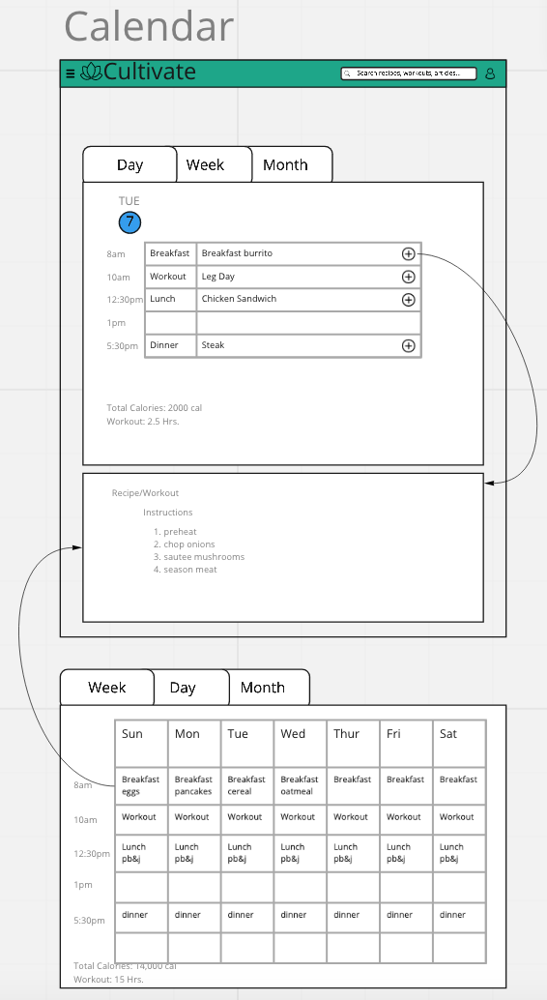
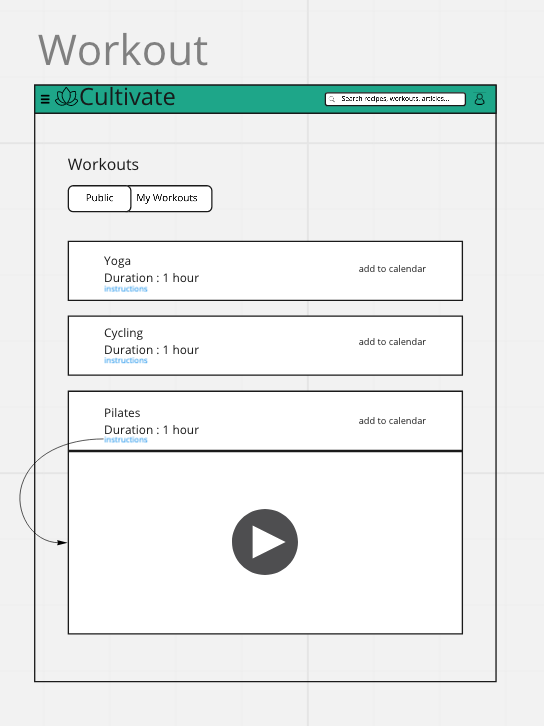
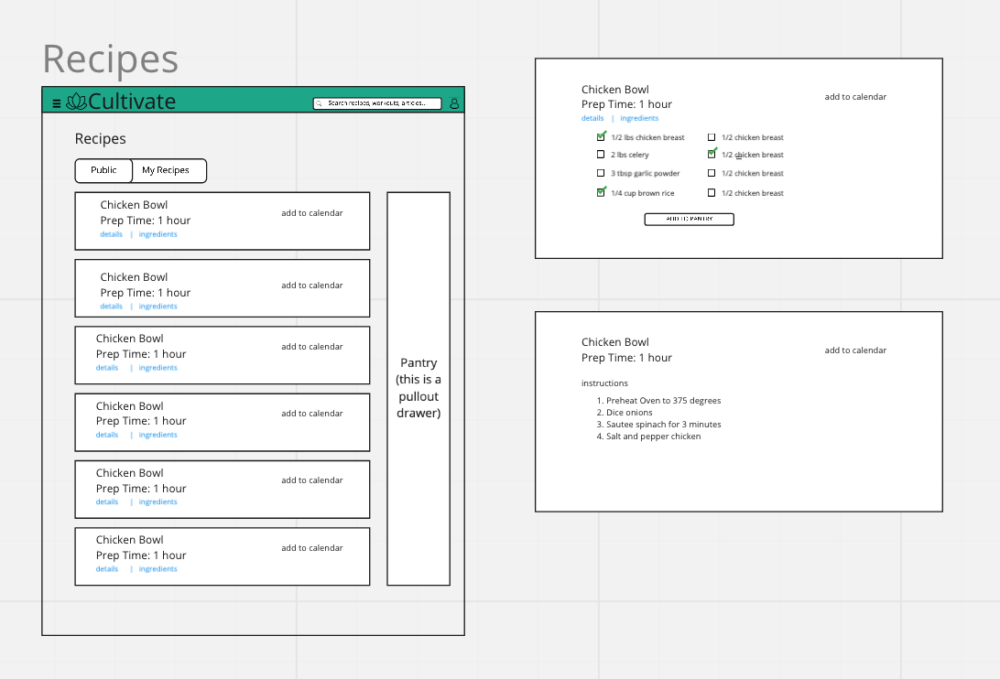
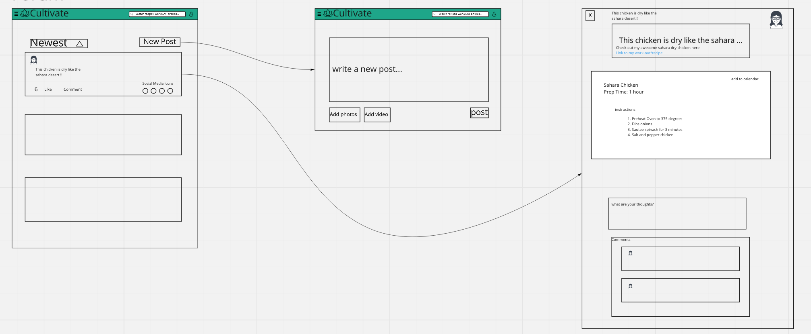

# Cultivate

## Table of Content
- [Overview](#Overview)
- [Tech Stack](#Tech-Stack)
- [Product Demo](#Product-Demo)
- [Front End Diagrams](#Front-End-Diagrams)
- [Team Members](#Team-Members)

 

## Overview
*Cultivate is a **Health** and **Wellness** application where individuals can come together as a community to **Design**, **Plan** and share their own **Workout Routines** and **Healthy Recipes**.*

## Features
***
+ A Recipes Component to search for or add new Recipes for your specific diet or needs.
+ A Workout Component to search for or add new workout videos/routines.
+ A Calendar for organizing your goals, workouts and meal times.
+ A Forum to share and post your thoughts, ideas, workouts and diets with others.

 

## Tech stack
***
 
 

### Front end
  
  

 
 

### Back end

  
  
  
  

  
 
 

### Cloud Delopment
 

  
  
  
  

 
 

### Project Management
 
  

 
 
 
 

## Product Demo
***

 
 
 
 

## Front End Diagrams
***
 

{ Login Screen }

 Users will be directed to a login page when first coming to - or returning to - Cultivate. They will be prompted to sign in or sign up. This page will display the cultivate logo as well as a small slogan underneath if requested. 

 
  

 
 

{ Navigation Menu }

The navigation menu allows users to navigate to various sections of the application. Users can select a navigation icon in the top left to toggle a drawer, where different areas of the app will be listed. 

 

 
 

{ Calendar }

The calendar component allows users to view their scheduled meals and/or workouts for any given day. Users may add their desired workouts/meals by selecting the ‘Add to Calendar’ button within the respective component.  

 

Features:  
* Add Recipes and workouts to their calendar for planning.  
 
* Delete recipes and workouts that were previously saved to their calendar  
 
* A weekly view, which will be the default/initial view that users interact with
 
  

 
 

{ Workouts }

This section will allow users to browse through a list of workouts that Cultivate or other active users have shared or made. The format will be similar to the “recipes” section, and users will  have the ability to expand a workout to see an instructional video or more details. They may also select a button to add a specific workout to their calendar.  

 

Features:  
* List 10 most recent workouts 
 
* Open up an instructions pane with details and/or video walkthrough  
 
* List all workouts with ability to sort and filter  
 
* Add a workout to calendar  
 
* Share to forum  
  

 
 

{ Recipes }

The recipe component allows the user to view recipes they save as well as public recipes. There will be two tabs: (1) a “public” tab that, when selected, will render the ten most recently saved recipes by all users, and (2) a “my recipes” tab that will render the ten most recently saved recipes of the current user. 

Users will open this component from the navigation pane. Each recipe will appear as a clickable tile, one on top of the other. When clicked, the tile will expand to show any additional details about the recipe, instructions, and a list of ingredients. 

Each tile will include buttons to allow users to share directly to the forum or copy a link referencing the recipe. At the top of the page, there will be options to sort and filter by criteria such as date, food category, time to prepare, and more. Additionally, an “Add to Calendar” button will add a recipe to that user’s calendar.  

 

Features:  
* Render tiles according to a users saved recipes (“My Recipes” tab) 
 
* Render an expanded view when a tile is clicked  
 
* List all recipes with ability to sort and filter  
 
* Add a Recipe to calendar  
 
* Share to forum  
  

 
 

{ Forum }

In this section, users will be able to see a list of public posts made by other users, interact with these stories (like a comment), and also be able to create a new post. The list of main features of the Forum section are shown below:

In the forum's overview, users will see a list of posts created by other users. This page will contain a "New Post" button at the top to add new posts and a list of posts below in their respective sections. In addition, each post will include the body, an incrementing like button, a comment button to open additional post details, and social media icons on the bottom right to share the post.
 

 

Features:  

* Render tiles according to a users saved recipes (“My Recipes” tab)

 

* Render an expanded view when a tile is clicked

 

* List all recipes with ability to sort and filter

 

* Add a Recipe to calendar

 

* Share to forum

  

 
 

### Back end and cloud diagrams
***
+ TODO: Put in the diagrams to a folder and explain them here

 
 
 

## Development Challenges
***
+ Developing the front end had some extra challenges since the backend was over architected and hard to run on local machines
+ Switching to a mobile first css layout is hard when css was not originally designed for it
+ Google Cloud Platform makes you jump through some hoops to enforce security

 
 

## Team Members
***
- Mike Ortiz
- Kaitlyn Gill
- Yi Qiao
- Charlie Paik
- Jihoon (Daniel) Kim
- Tim Liaw
- Josh Ayres
- Nicholas Anich
